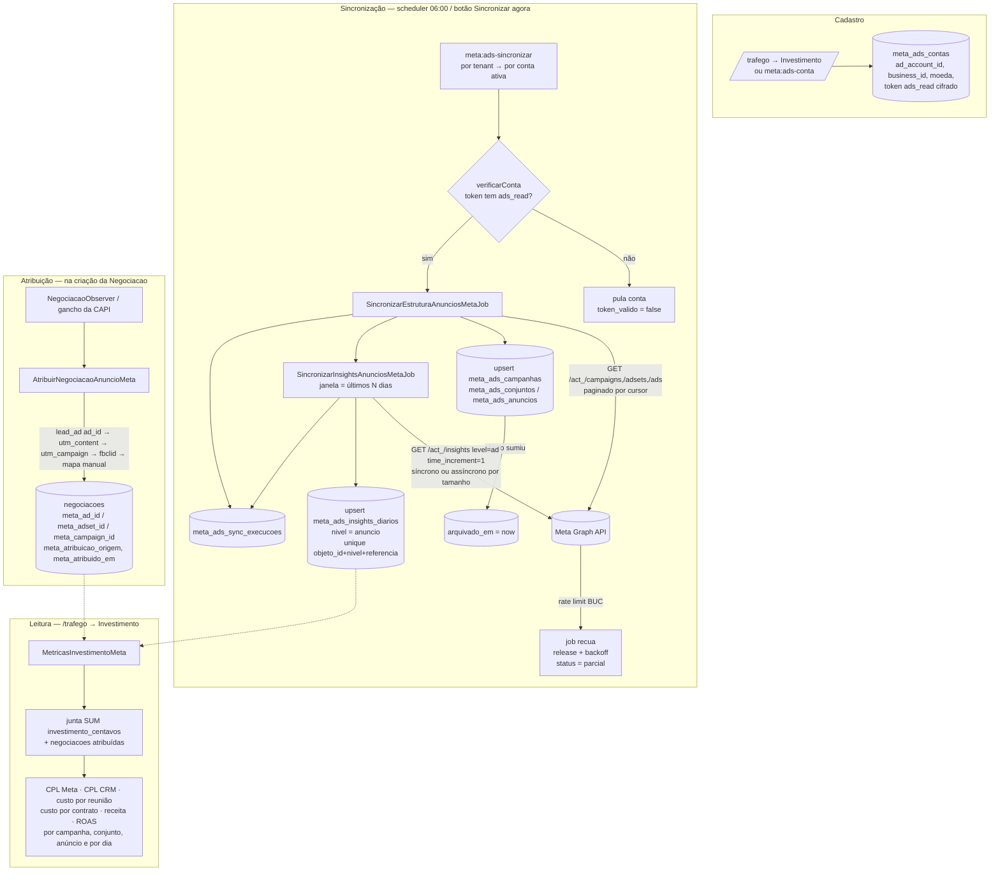

# Arquitetura — API de Marketing da Meta (Meta Ads)

> Documento de referência canônico da integração de **mídia paga**. Nomes de tabelas,
> colunas, enums, jobs, actions e rotas aqui definidos são a fonte da verdade para os
> prompts de implementação (`documents/api_meta/prompts/api_marketing_meta/` — cópia em
> `D:\ProjetosSandro\APIS\api_meta\docs\prompts\api_marketing_meta\`).
>
> Base: `documents/api_meta/descricao_api_marketing_meta.md` (ponteiros para o Meta for
> Developers). Pré-requisito: a integração da **API de Conversões (CAPI)** já está em
> produção neste CRM (ver `arquitetura_capi.md`) — esta integração **estende** aquele
> alicerce (cast de segredo, chave de cifra, abas de `/trafego`, padrão de comandos,
> `CurrentTenant::runAs`) e **não recria** nada dele.
>
> Cliente/escopo: ASF Advogados (tenant único hoje), duas frentes de campanha —
> **Bancário** e **Concurso** — rodando no Meta Ads.

---

## 1. Visão de engenharia de dados

Enquanto a CAPI é um **pipeline de saída** (o CRM manda eventos para a Meta), a Marketing
API é um **pipeline de entrada de leitura**: a estrutura de anúncios e os números de
investimento/resultado são puxados da Graph API, normalizados e gravados localmente, e
depois **cruzados com os resultados do CRM** (leads, reuniões, contratos, receita) para
produzir CPL real, custo por reunião, custo por contrato e ROAS por campanha.

Princípios:

| Princípio | Como é garantido |
|---|---|
| **Fila primeiro** | Nenhuma chamada à Graph API no ciclo de request do usuário. Toda sincronização roda em job na fila `meta-ads`. |
| **Idempotência** | `upsert` por id da Meta (`meta_campaign_id` / `meta_adset_id` / `meta_ad_id`) na estrutura e por `(objeto_id, nivel, referencia)` nos *insights*. Re-sincronizar nunca duplica. |
| **Fonte de verdade local** | As tabelas `meta_ads_*` são o que a UI e os relatórios leem. A Graph API só é consultada na sincronização. |
| **Dinheiro é inteiro** | Todo valor monetário (investimento, orçamento, CPC, CPM, custo por resultado, receita) é gravado em **centavos** (`unsignedBigInteger`), na moeda da conta. `float` só aparece na razão `roas` e em acessores `*_reais` de exibição. |
| **Janela de atribuição** | Os números da Meta assentam ao longo de ~28 dias. A sync diária re-puxa os últimos `config('meta.ads.reprocessar_dias', 28)` dias de *insights*. |
| **Rate limit respeitado** | O client lê `X-Business-Use-Case-Usage`; ao passar do teto (`config('meta.ads.rate_limit_teto_pct', 85)`) ou receber `estimated_time_to_regain_access`, para e o job recua (backoff / relatório assíncrono). |
| **Custo agregado, sem PII** | *Insights* são puxados **sem `breakdowns` demográficos** (nicho pequeno = risco de reidentificação). A atribuição liga `Negociacao` a ids de anúncio — **nada** do `Contato` é enviado à Meta (isso é a CAPI). |
| **Segredo cifrado, fora do `.env`** | O token `ads_read` de cada conta vive em `meta_ads_contas`, cifrado em repouso pelo cast `App\Casts\SegredoMeta` (mesma chave dedicada `META_CAPI_ENCRYPTION_KEY` já em uso), `#[Hidden]`. |
| **Isolamento multi-tenant** | Todas as tabelas usam `BelongsToTenant` + `TenantScope` (fail-closed). |
| **Estrutura não some** | Objeto que deixou de voltar da Meta é marcado `arquivado_em` (nunca deletado) — o histórico de *insights* dele continua válido. |

---

## 2. Pipeline



---

## 3. Modelo de dados

Todas as tabelas têm `id`, `tenant_id` (FK `tenants`, `constrained()->cascadeOnDelete()`,
**fora de `#[Fillable]`**, preenchida por `BelongsToTenant`) e `timestamps`.
`bruto` = coluna `json` com a resposta crua da Graph API (auditoria; expurgável).

### 3.1 `meta_ads_contas` — 1 linha por conta de anúncio, por tenant

| coluna | tipo | notas |
|---|---|---|
| `nome` | string | rótulo interno ("ASF — Bancário") |
| `ad_account_id` | string | só dígitos, **sem** `act_` (o client adiciona) — `unique(tenant_id, ad_account_id)` |
| `business_id` | string nullable | |
| `moeda` | string(3) nullable | `currency` da conta — os valores são gravados nela, sem conversão |
| `fuso_horario` | string nullable | `timezone_name` — alinha a `referencia` dos *insights* |
| `access_token` | text | **cifrado** por `App\Casts\SegredoMeta`; `#[Hidden]` — token de **usuário de sistema** com `ads_read` |
| `token_ultimos4` | string(4) nullable | em claro, só para exibir (`••••ZDZD`) |
| `token_scopes` | json nullable | escopos detectados (`ads_read`, `ads_management`) |
| `token_verificado_em` / `token_valido` | timestamp / bool nullable | último "testar conexão" |
| `conta_status` | string nullable | `account_status` (1 = ativa, 2 = desativada, …) |
| `atualizado_por_user_id` | FK `users` nullable, `nullOnDelete` | auditoria |
| `ativo` | boolean, default true | |
| `estrutura_sincronizada_em` / `insights_sincronizados_em` | timestamp nullable | telemetria |

Hook `saving` (espelha `MetaConversaoConfig`): trocar `access_token` →
`token_ultimos4 = substr(token, -4)`, zera `token_verificado_em` / `token_valido`.
Helpers: `mascararToken()`, `nodeId()` → `'act_'.$ad_account_id`, `scopeAtivas()`.

### 3.2 `meta_ads_campanhas` / `meta_ads_conjuntos` / `meta_ads_anuncios` — hierarquia

Campos comuns: FK do pai (`meta_ads_conta_id` na campanha; `meta_ads_campanha_id` no
conjunto; `meta_ads_conjunto_id` no anúncio), `meta_<nivel>_id` (id da Meta,
`unique(tenant_id, meta_<nivel>_id)`), `nome`, `status` (`MetaAdsStatus`),
`effective_status` (string crua da Meta — **sem enum**), `bruto`, `sincronizado_em`,
`arquivado_em` (nullable).

| tabela | colunas específicas |
|---|---|
| `meta_ads_campanhas` | `objetivo` (`MetaAdsObjetivo`), `orcamento_diario_centavos`, `orcamento_total_centavos`, `inicio_em`, `fim_em` |
| `meta_ads_conjuntos` | `optimization_goal` (string), `orcamento_diario_centavos`, `orcamento_total_centavos` |
| `meta_ads_anuncios` | `criativo_resumo` (json `{titulo, corpo, thumb_url, cta}`, best-effort do `creative`) |

Índices: `index(meta_ads_conta_id, arquivado_em)` (e equivalente por nível).
Helper de model: `entregando(): bool` → `effective_status === 'ACTIVE'`;
`scopeVigentes()` → `whereNull('arquivado_em')`.

### 3.3 `meta_ads_insights_diarios` — snapshot por objeto e dia

Gravado **só no nível anúncio**. Campanha / conjunto / conta são agregação na leitura
(`SUM` pela hierarquia local) — nunca dados duplicados por nível.

| coluna | tipo | notas |
|---|---|---|
| `meta_ads_conta_id` | FK | |
| `nivel` | string, default `anuncio` | `MetaAdsNivel` — hoje sempre `anuncio` |
| `objeto_id` | string | id da Meta do objeto — `unique(objeto_id, nivel, referencia)` |
| `referencia` | date | dia no fuso da conta |
| `investimento_centavos` | unsignedBigInteger, default 0 | `round((float) spend * 100)` |
| `impressoes` / `cliques` / `cliques_link` / `alcance` | unsignedBigInteger, default 0 | |
| `cpc_centavos` / `cpm_centavos` / `custo_por_resultado_centavos` | unsignedBigInteger nullable | |
| `ctr` | decimal(8,4) nullable | |
| `frequencia` | decimal(8,2) nullable | |
| `resultados` | unsignedInteger, default 0 | soma normalizada dos `action_type` de lead (ver §4 config) |
| `acoes` | json nullable | `actions` cru (todos os `action_type`) — expurgável |
| `bruto` | json | linha crua do `/insights` — expurgável |

Índices: `index(tenant_id, referencia)`, `index(meta_ads_conta_id, nivel, referencia)`.
Acessores só-leitura: `investimentoReais()` = `investimento_centavos / 100`, idem CPC/CPM.

### 3.4 `meta_ads_sync_execucoes` — auditoria de cada rodada

| coluna | tipo |
|---|---|
| `meta_ads_conta_id` | FK |
| `tipo` | `MetaAdsSyncTipo` (`estrutura` / `insights`) |
| `status` | `MetaAdsSyncStatus` (`ok` / `parcial` / `erro`) |
| `janela_inicio` / `janela_fim` | date nullable (só `insights`) |
| `objetos_afetados` | unsignedInteger, default 0 |
| `duracao_ms` | unsignedInteger nullable |
| `erro` | text nullable |
| `iniciado_em` / `concluido_em` | timestamp / timestamp nullable |

`status = parcial` = interrompida por rate limit; **não é erro** — a próxima rodada
completa.

---

## 4. Enums (`app/Enums/`)

| Enum | Valores | Notas |
|---|---|---|
| `MetaAdsNivel: string` | `conta`, `campanha`, `conjunto`, `anuncio` | `metaLevel()` → `account`/`campaign`/`adset`/`ad`; `label()` |
| `MetaAdsStatus: string` | `ACTIVE`, `PAUSED`, `DELETED`, `ARCHIVED` | `fromMeta(?string)` → default `PAUSED` p/ desconhecido |
| `MetaAdsObjetivo: string` | `OUTCOME_LEADS`, `OUTCOME_TRAFFIC`, `OUTCOME_ENGAGEMENT`, `OUTCOME_SALES`, `OUTCOME_AWARENESS`, `OUTCOME_APP_PROMOTION`, `OUTRO` | `fromMeta()` mapeia legados (`LEAD_GENERATION`→`OUTCOME_LEADS`, `LINK_CLICKS`→`OUTCOME_TRAFFIC`, `CONVERSIONS`→`OUTCOME_SALES`) |
| `MetaAdsSyncTipo: string` | `estrutura`, `insights` | |
| `MetaAdsSyncStatus: string` | `ok`, `parcial`, `erro` | |

> `effective_status` **não** vira enum (Meta tem ~15 valores voláteis) — string crua na
> coluna + helper `entregando()` no model.

---

## 5. Contrato de atribuição (`Negociacao` ↔ anúncio)

### 5.1 Colunas em `negociacoes` (adicionadas no prompt 05)

`meta_ad_id`, `meta_adset_id`, `meta_campaign_id` (string nullable),
`meta_atribuicao_origem` (`lead_ad` | `utm` | `fbclid` | `manual` | `null`),
`meta_atribuido_em` (timestamp nullable), `origem_utm` (json nullable —
`{utm_source, utm_medium, utm_campaign, utm_content, utm_term, fbclid, meta_ad_id}`
capturado do formulário de entrada). Índices em `meta_campaign_id` e `meta_ad_id`.

> As colunas `meta_event_id` / `meta_fbp` / `meta_fbc` / `meta_event_source_url` /
> `meta_client_ip` / `meta_client_user_agent` / `meta_captado_em` **já existem** (CAPI,
> migration `2026_09_01_000004`) — reaproveitadas, não recriadas.

### 5.2 Ordem de resolução (primeira que casar vence)

1. **Lead Ads** — `ad_id` (e `campaign_id`) do webhook de `leadgen`. Origem `lead_ad`.
   *(Se o CRM ainda não ingere lead ads, o prompt 05 só deixa o gancho — não implementa o
   webhook.)*
2. **`meta_ad_id` / `utm_content` numérico** → casa com `MetaAdsAnuncio` vigente;
   preenche adset/campaign pela hierarquia local. Origem `utm`.
3. **`utm_campaign`** → `MetaAdsCampanha` por `meta_campaign_id` ou por `nome`/slug; só
   seta `meta_campaign_id`. Origem `utm`.
4. **`fbclid`** presente e nada casou → `meta_atribuicao_origem = 'fbclid'`, ids nulos
   ("veio do Meta, anúncio desconhecido").
5. **Mapa manual** — `config('meta.ads.mapa_campanha')[<slug da campanha do CRM>]`
   (o slug vem da `MetaConversaoConfig` resolvida pelo `ResolverCampanhaConversao` da CAPI)
   → `meta_campaign_id`. Origem `manual`.

Regras: atribuição é **best-effort e não bloqueia** o save da negociação (exceção logada e
engolida); um `meta_ad_id` já atribuído **nunca** regride para origem de menor prioridade;
reprocessável por `meta:ads-reatribuir` (útil depois de uma sync que trouxe anúncios novos).

### 5.3 Métricas derivadas (`App\Support\Meta\MetricasInvestimentoMeta`)

Por objeto do nível pedido, num intervalo `[de, ate]`:

| métrica | fórmula |
|---|---|
| `investido_centavos` | `SUM(meta_ads_insights_diarios.investimento_centavos)` dos anúncios sob o objeto |
| `cpm_centavos` | `investido / impressoes * 1000` |
| `ctr` | `cliques_link / impressoes` |
| `leads_meta` | `SUM(resultados)` |
| `cpl_meta_centavos` | `investido / max(leads_meta, 1)` |
| `leads_crm` | `COUNT(negociacoes)` atribuídas ao objeto, `created_at` no intervalo |
| `cpl_crm_centavos` | `investido / max(leads_crm, 1)` |
| `reunioes` / `custo_reuniao_centavos` | negociações atribuídas que alcançaram etapa de reunião |
| `contratos` / `custo_contrato_centavos` | negociações atribuídas ganhas (etapa "fechado/ganho") |
| `receita_centavos` | `SUM(negociacoes.valor * 100)` das ganhas atribuídas |
| `roas` | `receita_centavos / max(investido_centavos, 1)` (float, 2 casas; 0 quando `investido = 0`) |

Atribuição por nível: `anuncio` → `meta_ad_id`; `conjunto` → `meta_adset_id`; `campanha` →
`meta_campaign_id`. `serieDiaria()` devolve o mesmo por `referencia` (gráfico).

---

## 6. Política de janelas e reprocessamento

| Situação | Comportamento |
|---|---|
| Sync diária | Estrutura completa + *insights* dos últimos `config('meta.ads.reprocessar_dias', 28)` dias (`upsert` idempotente) |
| Janela > `config('meta.ads.async_dias', 32)` | `MarketingApiClient` usa o **relatório assíncrono** (`POST /insights` → poll `report_run_id` → download paginado) |
| Recarga histórica | `php artisan meta:ads-backfill-insights --conta= --desde= --ate= --force` |
| Objeto sumiu da Meta | `arquivado_em = now()` (não deletar — *insights* históricos continuam) |
| Rate limit no meio | Rodada fecha como `parcial`; o job re-agenda (`release`) a parte não coberta, encolhendo a janela pela metade se reincidir |

---

## 7. LGPD / privacidade de dados de mídia

- *Insights* são puxados **agregados** — sem `breakdowns` de idade/gênero/região por
  padrão (nicho jurídico pequeno = risco de reidentificação). Qualquer relatório
  demográfico é decisão explícita, fora deste escopo.
- Esta integração **não envia nada** para a Meta — só lê. Nenhum dado pessoal do `Contato`
  sai (o envio de PII hasheada é a CAPI, com gate de consentimento próprio).
- A atribuição associa `Negociacao` a ids de anúncio da Meta; não cria perfil comportamental
  nem cruza com dados sensíveis.
- **Retenção**: `bruto` / `acoes` dos *insights* e `bruto` da estrutura são expurgados por
  `meta:ads-expurgar-brutos` após `config('meta.capi.retencao_dias')` (mesma política da
  CAPI), preservando os agregados numéricos.

---

## 8. Configuração (DB-first — herdando a decisão da CAPI)

| Camada | Onde | Conteúdo |
|---|---|---|
| Aplicação | `.env` → `config/meta.php` seção `ads` | `META_ADS_API_VERSION`, `META_ADS_QUEUE` (`meta-ads`), `META_ADS_REPROCESSAR_DIAS` (28), `META_ADS_ASYNC_DIAS` (32), `META_ADS_RATE_LIMIT_TETO` (85); arrays `insights_fields`, `acoes_resultado`, `mapa_campanha` |
| Chave de cifra | `.env` | **reusa `META_CAPI_ENCRYPTION_KEY`** — mesmo cast `App\Casts\SegredoMeta`, nenhuma chave nova |
| Credenciais de conta | **banco** (`meta_ads_contas`) | `ad_account_id`, `business_id`, `access_token` (cifrado, `ads_read`) |

- Cadastro da conta: aba **`/trafego → Investimento`** ou comando
  **`php artisan meta:ads-conta`** (headless — token via `password()`).
- **Escopo do token**: a Marketing API **não** usa o token do Events Manager. Exige token
  de **usuário de sistema** do Business Manager com `ads_read`, usuário atribuído à conta,
  e *Advanced Access* a `ads_read` no app (produção). Escrita (pausar/ativar conjunto —
  opcional) exige `ads_management`. Provisionamento é do cliente (ASF); o código só valida
  o escopo e degrada com mensagem clara quando faltar.

---

## 9. Componentes de código (nomes canônicos)

| Camada | Classe | Papel |
|---|---|---|
| Cast | `App\Casts\SegredoMeta` | **reutilizado** — cifra o `access_token` da conta |
| DTO | `App\Support\Meta\MapiResultado` (`final readonly`) | resposta normalizada (`dados`, `throttled`, `esperarSegundos`, `usoBuc`, `retentavel()`) |
| Support | `App\Support\Meta\MarketingApiClient` | `listar()` (cursor pagination), `insightsAnuncios()` (sync/assíncrono), `verificarConta()`, `atualizarStatus()` (opcional) |
| Support | `App\Support\Meta\MetricasInvestimentoMeta` | junta *insights* + negociações atribuídas → CPL/ROAS por nível e por dia |
| Action | `App\Actions\Meta\SincronizarEstruturaAnunciosMeta` | upsert campanha/conjunto/anúncio + marca órfãos |
| Action | `App\Actions\Meta\SincronizarInsightsAnunciosMeta` | upsert `meta_ads_insights_diarios` (nível anúncio) para uma janela |
| Action | `App\Actions\Meta\AtribuirNegociacaoAnuncioMeta` | resolve o anúncio de uma negociação (§5.2) |
| Job | `App\Jobs\SincronizarEstruturaAnunciosMetaJob` | fila `meta-ads`, `WithoutOverlapping`, recua em throttle |
| Job | `App\Jobs\SincronizarInsightsAnunciosMetaJob` | idem; encolhe a janela ao re-tentar |
| Controller | `App\Http\Controllers\TrafegoInvestimentoController` | aba Investimento (painel + CRUD de conta + sincronizar + testar) |
| Resource | `App\Http\Resources\MetaAdsContaResource` (se necessário) | projeção segura da conta (sem token) |
| Commands | `meta:ads-conta`, `meta:ads-sincronizar`, `meta:ads-backfill-insights`, `meta:ads-reatribuir`, `meta:ads-expurgar-brutos` | operação (todos iteram tenants em `CurrentTenant::runAs`) |
| Log | canal `meta-ads` (`config/logging.php`, daily 14d, `storage/logs/meta-ads-*.log`) | client + actions + jobs — **sem token** |

---

## 10. Rotas (grupo `auth` + `verified`, `routes/web.php`)

```
GET    trafego/investimento                              trafego.investimento.index
POST   trafego/investimento/contas                       trafego.investimento.contas.store
PATCH  trafego/investimento/contas/{conta}               trafego.investimento.contas.update
DELETE trafego/investimento/contas/{conta}               trafego.investimento.contas.destroy
POST   trafego/investimento/contas/{conta}/testar-conexao trafego.investimento.contas.testar-conexao
POST   trafego/investimento/sincronizar                  trafego.investimento.sincronizar
```

> **Escrita (pausar/ativar conjunto) não foi implementada** (prompt 06): a rota
> `conjuntos/{conjunto}/status` **não existe**. A UI mostra o `escreve_habilitado` por conta
> (token com `ads_management`) mas não expõe botão de pausar. É escopo de um prompt futuro
> junto com `MarketingApiClient::atualizarStatus()`.

Página Inertia: `crm/TrafegoInvestimento.vue` (layout `CrmLayout` automático;
`PAGE_SCREEN` mapeia para o screen `trafego`). `TrafegoTabs.vue` ganha a 4ª aba
**Investimento** (`Configuração | Eventos | Diagnóstico | Investimento`).

Agendamento (`routes/console.php`):

```php
Schedule::command('meta:ads-sincronizar')->dailyAt('06:00')->withoutOverlapping()->onOneServer();
Schedule::command('meta:ads-expurgar-brutos')->weeklyOn(1, '04:30')->withoutOverlapping()->onOneServer();
```

---

## 11. Decisões em aberto / a confirmar na implementação

- **`ad_account_id` das campanhas ASF** (Bancário / Concurso): uma conta só ou uma por
  campanha? O modelo suporta N contas por tenant; confirmar no cadastro.
- **Ingestão de Lead Ads**: hoje o CRM não recebe webhook de `leadgen`. O prompt 05 deixa
  o gancho pronto (`meta_atribuicao_origem = 'lead_ad'`), mas a origem real da maioria dos
  leads será `utm` (link do anúncio) ou `manual`. Implementar o webhook é escopo futuro.
- **Padrão de UTM nos anúncios**: para a atribuição automática funcionar, os anúncios
  precisam usar `utm_source=facebook|instagram` e `utm_content={{ad.id}}` (ou
  `utm_campaign={{campaign.id}}`) nos parâmetros de URL. É configuração no Gerenciador de
  Anúncios (cliente).
- **Escrita (pausar/ativar conjunto)**: entregar só se o token tiver `ads_management`.
  Se o prazo apertar, o endpoint `conjuntos/{conjunto}/status` responde 501 e a UI esconde
  o botão (documentar aqui a decisão final).
- **Etapa "reunião" e "fechado/ganho"**: usar `etapa_funil.ordem` ou o histórico de
  mudança de etapa (`negociacao_historicos`)? Definir no prompt 05 conforme o que já
  existe.
- **Moeda**: assume-se BRL; se alguma conta vier em outra moeda, os valores ficam nela e a
  UI formata por `meta_ads_contas.moeda` (sem conversão).

---

## 12. Estado da implementação (prompts 00–07)

- **Prompt 00 ✅** — este documento. Série de prompts em `documents/api_meta/prompts/api_marketing_meta/`.
- **Prompt 01 ✅** — `config/meta.php` seção `ads`, migration `meta_ads_contas`, model
  `MetaAdsConta` (reusa `SegredoMeta`), comando `meta:ads-conta`.
- **Prompt 02 ✅** — 5 enums (`MetaAdsNivel/Status/Objetivo/SyncTipo/SyncStatus`), migration
  `meta_ads_campanhas/_conjuntos/_anuncios/_insights_diarios/_sync_execucoes`, 5 models, 5
  factories. Dinheiro em centavos; `effective_status` string crua + `entregando()`.
- **Prompt 03 ✅** — `MapiResultado` (DTO), `MarketingApiClient` (`listar()` cursor
  pagination, `insightsAnuncios()` sync/assíncrono, `verificarConta()`/`registrarVerificacao()`,
  parsing de `X-Business-Use-Case-Usage`). Canal de log `meta-ads`.
- **Prompt 04 ✅** — Actions `SincronizarEstruturaAnunciosMeta` (órfãos por ids-vistos →
  `arquivado_em`) e `SincronizarInsightsAnunciosMeta` (`resultados` = MAX dos action_type de
  lead), Jobs (`WithoutOverlapping`, `parcial` re-agenda / parte a janela), comando
  `meta:ads-sincronizar`, schedule 06:00.
- **Prompt 05 ✅** — atribuição: colunas `meta_*_id`/`meta_atribuicao_origem`/`origem_utm` em
  `negociacoes`, `AtribuirNegociacaoAnuncioMeta` (gancho no `NegociacaoObserver::created`),
  `MetricasInvestimentoMeta` + DTO `MetricaInvestimento` (CPL real, custo/reunião via
  `etapa.ordem >= min(ordem-do-trecho)`, ROAS), comando `meta:ads-reatribuir`.
  Captura de utm/fbclid no `StoreNegociacaoRequest` + controller.
- **Prompt 06 ✅** — aba `/trafego → Investimento` (`TrafegoInvestimentoController` +
  `crm/TrafegoInvestimento.vue`): KPIs, gráfico investido×leads/dia, tabela com drill
  campanha→conjunto→anúncio, CRUD de conta (`Store/UpdateMetaAdsContaRequest` + trait),
  prop `saude` deferred (status ao vivo da conta), `sincronizar` via `Bus::chain`. 4ª aba
  em `TrafegoTabs`, `PAGE_SCREEN` atualizado. **Sem escrita** (ver §11). `access_token`
  nunca serializado.
- **Prompt 07 ✅** — fechamento.
  - Comandos `meta:ads-backfill-insights {--conta,--desde,--ate,--force}` (recarga
    histórica; janela grande → assíncrono) e `meta:ads-expurgar-brutos` (retenção:
    zera `bruto`/`acoes`, preserva agregados; `chunkById` + `$model->update()`,
    respeita `TenantScope`). Schedule `meta:ads-expurgar-brutos` semanal seg 04:30.
  - `info` por rodada de sync no canal `meta-ads` (`conta`, `status`, `objetos`,
    `janela`, `duracao_ms`) — client já loga `debug`/`warning`. Sem token nos logs
    (verificado: `grep EAA storage/logs` limpo após a suíte).
  - Testes novos: `MapiResultadoTest` (unit), `MetaAdsBackfillInsightsTest`,
    `MetaAdsExpurgoTest`, `MetaAdsIsolamentoTenantTest`. Resto da matriz já coberto:
    `MarketingApiClientTest`, `SincronizarAnunciosMetaTest` (estrutura+insights+comando),
    `AtribuirNegociacaoAnuncioMetaTest`, `MetricasInvestimentoMetaTest`,
    `TrafegoInvestimentoTest`, `MetaAdsContaTest`, `MetaAdsEstruturaTest`.
  - [`runbook_ads.md`](runbook_ads.md).
  - Suíte 346 verdes / 2 skip · phpstan 61 (baseline) · pint limpo · `npm run build` ok.

**Série da API de Marketing da Meta CONCLUÍDA (prompts 00–07).**
